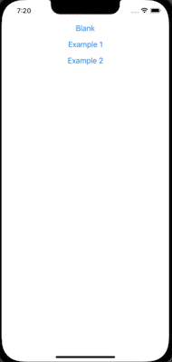
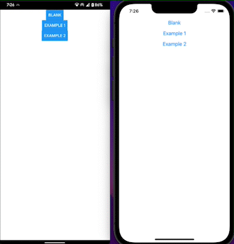

# React Native Bottom Sheet Using Reanimated 2

Create Custom Bottom Sheet in react native using [Reanimated 2](https://docs.swmansion.com/react-native-reanimated/)

## Demo

Bottom Sheet Demo



Demo on Android (Left) and Ios (Rigth)



## Run Locally

Install dependencies

```bash
  npm install
```

Start the server

```bash
  npm start -- --reset-cache
```

Run on IOS

```bash
  npx pod-install
  npx react-native run-ios
```

Run on ANDROID

```bash
  npx react-native run-android
```
