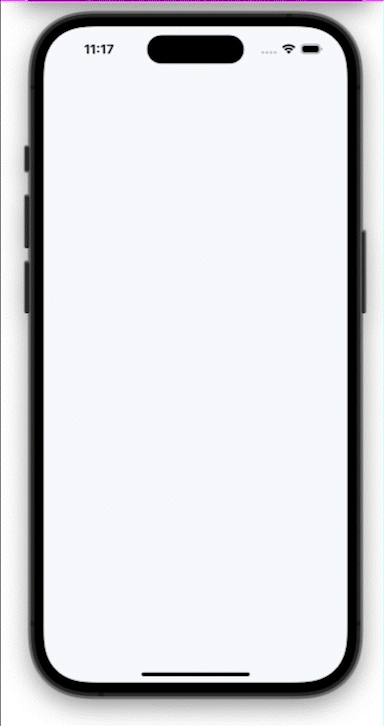
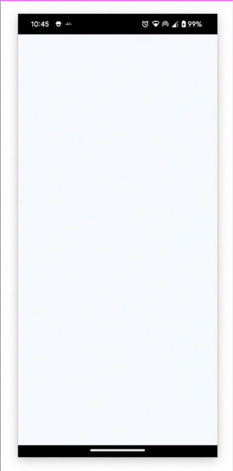

# React Native Flatlist Grid Reveal Animation Using Moti

Create Flatlist Grid Reveal Animation in React Native using [Moti](https://moti.fyi/)

## Demo

Demo on iOS



Demo on Android



## Run Locally

Install dependencies

```bash
npm install
```

For iOS

```bash
npx pod-install
```

Start the server

```bash
npm start -- --reset-cache
```

Run on IOS

```bash
npx react-native run-ios
```

Run on ANDROID

```bash
npx react-native run-android
```

Open The App

```bash
Open the app and click on "Flatlist Grid Reveal Animation Using Moti"
```
