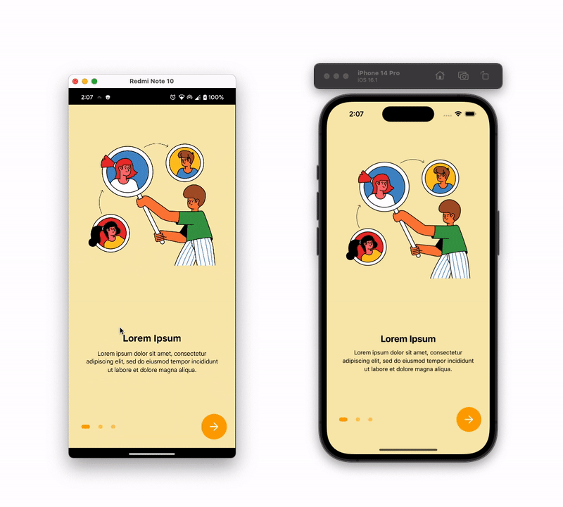

# React Native Onboarding Screen Using Reanimated 2 and FlatList

Create Onboarding Screen in React Native using [Reanimated 2](https://docs.swmansion.com/react-native-reanimated/docs)

## Demo

Demo on Android and iOS



## Run Locally

Install dependencies

```bash
npm install
```

For iOS

```bash
npx pod-install
```

Start the server

```bash
npm start -- --reset-cache
```

Run on IOS

```bash
npx react-native run-ios
```

Run on ANDROID

```bash
npx react-native run-android
```

Open The App

```bash
Open the app and click on "Onboarding Screen Using Reanimated 2"
```
