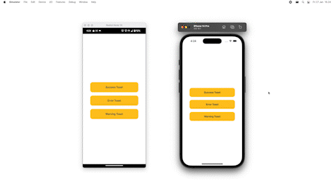
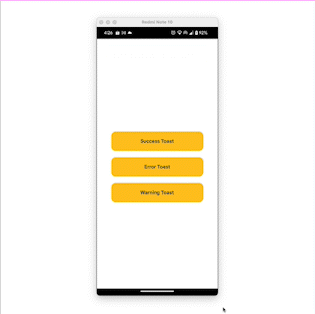

# React Native Custom Swipeable Toast Using Reanimated 2 and Gesture Handler

Create Custom Swipeable Toast in React Native using [Reanimated 2](https://docs.swmansion.com/react-native-reanimated/docs) and [Gesture Handler](https://docs.swmansion.com/react-native-gesture-handler/docs/)

## Demo

Demo on Android and iOS



Demo Swipe



## Run Locally

Install dependencies

```bash
npm install
```

For iOS

```bash
npx pod-install
```

Start the server

```bash
npm start -- --reset-cache
```

Run on IOS

```bash
npx react-native run-ios
```

Run on ANDROID

```bash
npx react-native run-android
```

Open The App

```bash
Open the app and click on "Custom Toast Using Reanimated 2 and Gesture Handler"
```
