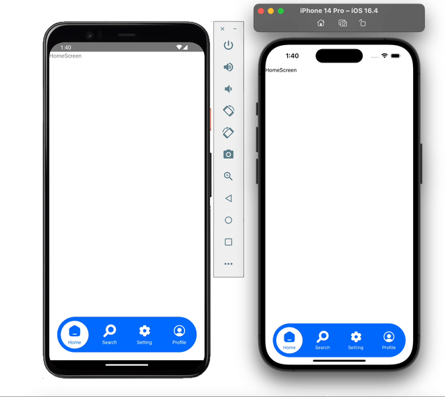

# React Native Custom Animated Bottom Tab Using Reanimated

Create Custom Animated Bottom Tab in React Native using [Reanimated](https://docs.swmansion.com/react-native-reanimated/docs)

## Demo 1

Demo on Android and iOS



## Demo 2

Demo on Android and iOS


## Run Locally

Install dependencies

```bash
npm install
```

For iOS

```bash
npx pod-install
```

Start the server

```bash
npm start -- --reset-cache
```

Run on IOS

```bash
npx react-native run-ios
```

Run on ANDROID

```bash
npx react-native run-android
```

Open The App

```bash
Open the app and click on "Custom Animated Bottom Tab"
```
