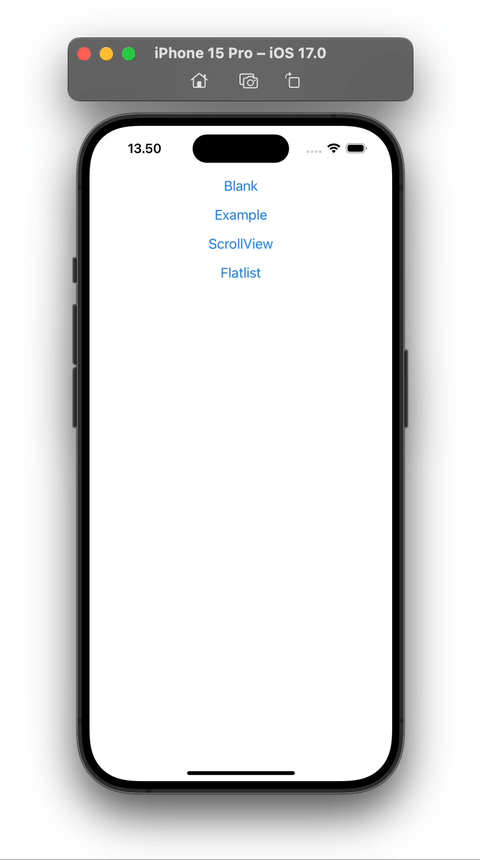
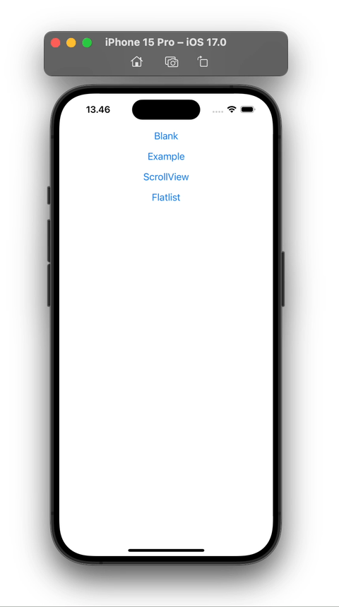

# React Native Bottom Sheet Scroll

Create Custom Bottom Sheet Scroll in react native using [Reanimated](https://docs.swmansion.com/react-native-reanimated/) and [Gesture Handler](https://docs.swmansion.com/react-native-gesture-handler/docs/)

## Demo

Demo on Android (Left) and Ios (Rigth)


BottomSheet Demo



BottomSheet ScrollView Demo


BottomSheet Flatlist Demo



## Run Locally

Install dependencies

```bash
npm install
```

For iOS

```bash
npx pod-install
```

Start the server

```bash
npm start -- --reset-cache
```

Run on IOS

```bash
npx react-native run-ios
```

Run on ANDROID

```bash
npx react-native run-android
```

Open The App

```bash
Open the app and click on "16. Bottom Sheet Scroll"
```
