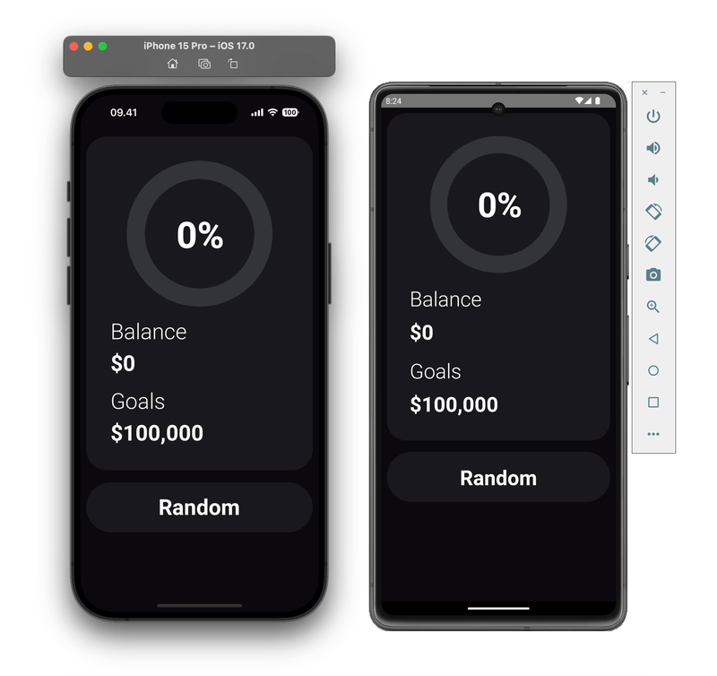

# React Native Animated Circular Progress Bar

Create Animated Circular Progress Bar in React Native using [Reanimated](https://docs.swmansion.com/react-native-reanimated/) and [Skia](https://shopify.github.io/react-native-skia/docs/getting-started/installation)

## Demo

Demo on iOS (Left) and Android (Right)



## Run Locally

Install dependencies

```bash
npm install
```

For iOS

```bash
npx pod-install
```

Start the server

```bash
npm start -- --reset-cache
```

Run on IOS

```bash
npx react-native run-ios
```

Run on ANDROID

```bash
npx react-native run-android
```

Open The App

```bash
Open the app and click on "22. Animated Circular Progress Bar Using Reanimated 3 and Skia"
```
